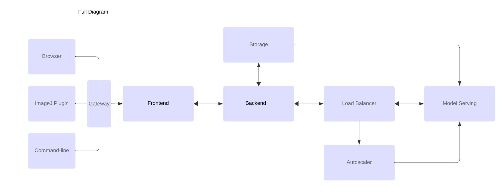
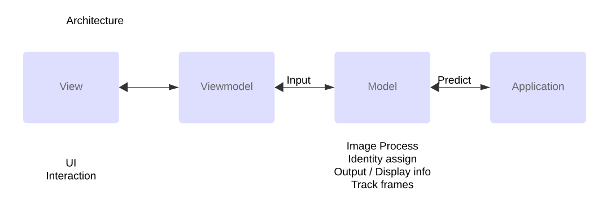

# MicroNuclei_WebApp

A web demo for micronuclei detection project.

# Software Architecture



# Getting Started
Develop under conda virtual environment ```conda activate mn_web```

Start the console by ```streamlit run main.py```

Web link: www.... generated by localhost.run ```ssh -R 80:localhost:8501 nokey@localhost.run```


# Features
- Cloud-based deployment of deep-learning models
- Scalable platform that minimizes cost and inference time
- Drag and drop interface for running predictions and tracks


# TODO
- add tiff input